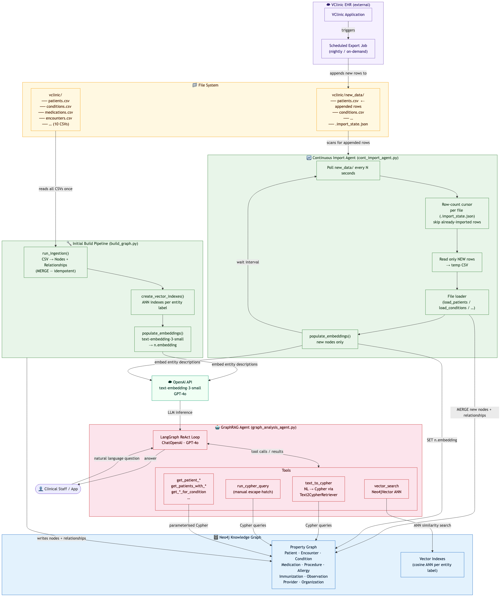
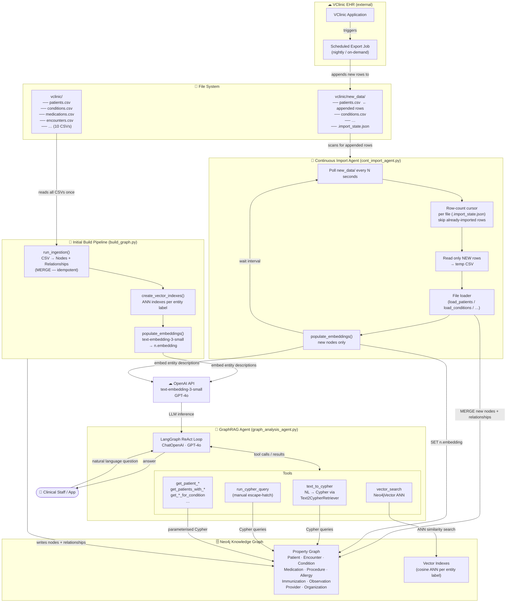

This is the patients analysis project with graphRAG

the project config info is in the local .env file

this project uses a locally deployed neo4j docker instance with the connection info in the .env file

---

## Project Structure

```
graphRag/
├── app.py                        # CLI entrypoint (build / chat / ask)
├── requirements.txt
├── .env.example                  # Copy to .env and fill in credentials
└── src/
    ├── config.py                 # Pydantic settings (reads .env)
    ├── graph/
    │   ├── schema.py             # Node labels, constraints, index definitions + SCHEMA_TEXT
    │   ├── ingestion.py          # CSV → Neo4j ingestion pipeline
    │   └── queries.py            # Cypher query helpers
    ├── embeddings/
    │   └── vector_store.py       # Vector index creation & embedding population
    ├── agent/
    │   ├── prompts.py            # System prompt for the LangGraph agent
    │   ├── tools.py              # LangChain tools (text_to_cypher, vector_search, …)
    │   ├── graph_analysis_agent.py  # LangGraph agent (StateGraph + ToolNode)
    │   └── cont_import_agent.py  # Continuous import agent (polls new_data/)
    └── pipeline/
        └── build_graph.py        # Orchestrates ingestion + embedding (run once)
```

## Knowledge Graph Schema

**Node types** (deduplicated by code/id):
`Patient` · `Organization` · `Provider` · `Encounter` · `Condition` · `Medication` · `Procedure` · `Allergy` · `Immunization` · `Observation`

**Key relationships:**
```
(Patient)-[:HAS_ENCOUNTER]->(Encounter)-[:PERFORMED_BY]->(Provider)
                                        -[:AT]->(Organization)
(Patient)-[:HAS_CONDITION {start,stop}]->(Condition)
(Patient)-[:PRESCRIBED    {start,stop,reason}]->(Medication)
(Patient)-[:UNDERWENT     {start,reason}]->(Procedure)
(Patient)-[:HAS_ALLERGY   {severity}]->(Allergy)
(Patient)-[:IMMUNIZED_WITH {date}]->(Immunization)
(Patient)-[:HAS_OBSERVATION {date,value,units}]->(Observation)
(Provider)-[:WORKS_AT]->(Organization)
```

## Setup

### 1. Create `.env`
```bash
cp .env.example .env
# Edit .env with your Neo4j connection details and OpenAI API key
```

### 2. Install dependencies
```bash
python -m venv .venv && source .venv/bin/activate
pip install -r requirements.txt
```

### 3. Build the knowledge graph
```bash
python app.py build --data-dir /path/to/vclinic/csvs
```
This will:
- Apply schema constraints & indexes in Neo4j
- Ingest all 10 CSV files (patients, encounters, conditions, medications, procedures, allergies, immunizations, observations, providers, organizations)
- Create vector indexes for clinical entities
- Generate OpenAI embeddings for Condition, Medication, Procedure, Allergy, Immunization, Observation nodes

### 4. Chat with the agent
```bash
# Interactive session
python app.py chat

# Single question
python app.py ask-once "What conditions does patient Brekke have?"
```

## Example Questions

- *"What conditions does Maurice Brekke have?"*
- *"How many patients have been diagnosed with hypertension?"*
- *"What medications are commonly prescribed for diabetes?"*
- *"Show me the encounter history for patient [UUID]"*
- *"Which procedures are most often performed for acute bronchitis?"*
- *"List all allergies for patient [name]"*
- *"Which providers work at Fitchburg Outpatient Clinic?"*

## System Architecture



<details>
<summary>Mermaid source</summary>



</details>

## Tech Stack

| Layer | Technology |
|---|---|
| Graph DB | Neo4j (local Docker) |
| Query Language | Cypher |
| Vector Search | Neo4j built-in vector index |
| Embeddings | OpenAI `text-embedding-3-small` |
| LLM | OpenAI GPT-4o |
| Agent Framework | LangGraph (StateGraph + ToolNode) |
| Tool Integration | LangChain tools + `langchain-neo4j` |
| CLI | Typer + Rich |


this proejct used openAI models, the openai API key is in local variable already


